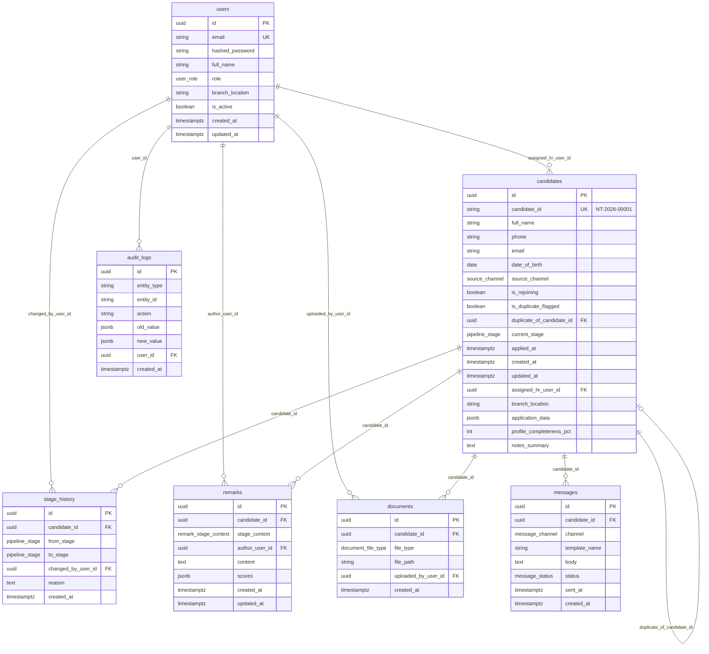

# Nippon Toyota Recruitment Portal — Entity Relationship Diagram

## Enums

| Enum | Values |
|------|--------|
| **user_role** | `ADMIN`, `LOCAL_HR`, `HEAD_OFFICE_HR`, `DEPARTMENT_HEAD`, `SALARY_TEAM` |
| **pipeline_stage** | `NEW_APPLICATION`, `AWAITING_LOCAL_INTERVIEW`, `LOCAL_HR_REVIEW_COMPLETE`, `AWAITING_HEAD_OFFICE_INTERVIEW`, `HEAD_OFFICE_INTERVIEW_COMPLETE`, `SUITABLE_FOR_HIRE`, `SALARY_PENDING`, `SALARY_APPROVED`, `OFFER_SENT`, `OFFER_ACCEPTED`, `OFFER_DECLINED`, `JOINING_SCHEDULED`, `JOINED`, `REJECTED`, `ON_HOLD` |
| **source_channel** | `WALK_IN`, `INDEED`, `REFERRAL`, `CAMPUS`, `OTHER` |
| **remark_stage_context** | `LOCAL_HR`, `HEAD_OFFICE_HR`, `TECHNICAL_TEST`, `DEPT_HEAD` |
| **document_file_type** | `RESUME`, `ID_PROOF`, `EDUCATION_CERT`, `OFFER_LETTER`, `JOINING_FORM`, `OTHER` |
| **message_channel** | `WHATSAPP`, `EMAIL`, `SMS` |
| **message_status** | `PENDING`, `SENT`, `DELIVERED`, `FAILED` |

## Notes

- Primary keys are **UUID** across all entities.
- `candidates.candidate_id` is the human-readable ID (`NT-{YEAR}-{5-digit}`), separate from internal `id`.
- `candidates.application_data` stores structured fields from the recruitment application form.
- Every pipeline stage change writes a row to `stage_history`.
- Duplicate applications are flagged via `is_duplicate_flagged` and `duplicate_of_candidate_id` — records are never auto-merged.
