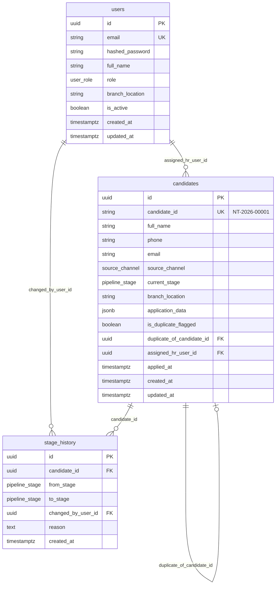

# Nippon Toyota Recruitment Portal: Database Schema

Three core tables for now: HR users, candidates, and stage history.



## Enums

| Enum | Values |
|------|--------|
| **user_role** | `ADMIN`, `LOCAL_HR`, `HEAD_OFFICE_HR`, `DEPARTMENT_HEAD`, `SALARY_TEAM` |
| **pipeline_stage** | `NEW_APPLICATION`, `AWAITING_LOCAL_INTERVIEW`, `LOCAL_HR_REVIEW_COMPLETE`, `AWAITING_HEAD_OFFICE_INTERVIEW`, `HEAD_OFFICE_INTERVIEW_COMPLETE`, `SUITABLE_FOR_HIRE`, `SALARY_PENDING`, `SALARY_APPROVED`, `OFFER_SENT`, `OFFER_ACCEPTED`, `OFFER_DECLINED`, `JOINING_SCHEDULED`, `JOINED`, `REJECTED`, `ON_HOLD` |
| **source_channel** | `WALK_IN`, `INDEED`, `REFERRAL`, `CAMPUS`, `OTHER` |

## Notes

All tables use UUID primary keys.

HR sees IDs like `NT-2026-00001`. That is the public candidate number, separate from the internal `id`.

Extra form fields go in `application_data` as JSON so the application form can grow without schema changes.

Every stage move gets a row in `stage_history`.

If the same phone or email applies again, we set `is_duplicate_flagged` and link to the original in `duplicate_of_candidate_id`. HR handles it manually.

## API skeleton

| Method | Path | Purpose |
|--------|------|---------|
| GET | `/health` | Health check |
| GET | `/api/v1/candidates` | List candidates |
| POST | `/api/v1/candidates` | Create from application form |
| GET | `/api/v1/candidates/{id}` | Get one candidate |
| POST | `/api/v1/candidates/{id}/stage` | Move to next stage |
| GET | `/api/v1/candidates/{id}/stage-history` | View stage history |

Run locally:

```bash
cd backend
py -m venv venv
venv\Scripts\activate
pip install -r requirements.txt
copy .env.example .env
alembic upgrade head
python seed.py
uvicorn app.main:app --reload
```
