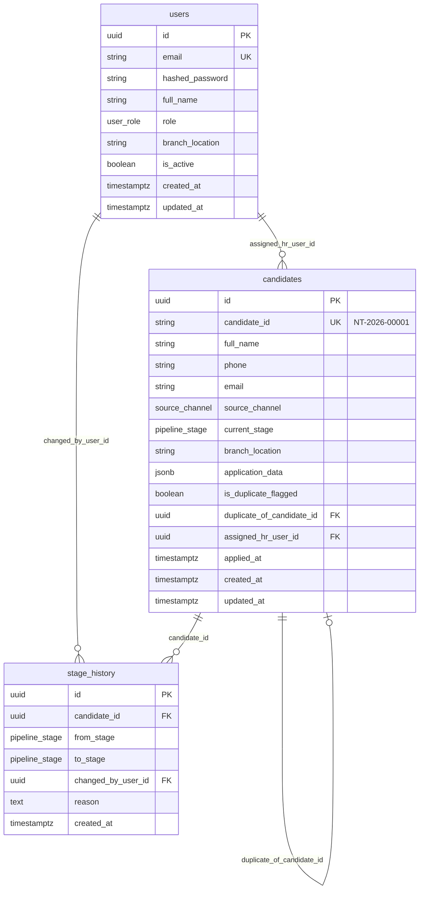

# Nippon Toyota Recruitment Portal



## Enums

| Enum | Values |
|------|--------|
| user_role | ADMIN, LOCAL_HR, HEAD_OFFICE_HR, DEPARTMENT_HEAD, SALARY_TEAM |
| pipeline_stage | NEW_APPLICATION, AWAITING_LOCAL_INTERVIEW, LOCAL_HR_REVIEW_COMPLETE, AWAITING_HEAD_OFFICE_INTERVIEW, HEAD_OFFICE_INTERVIEW_COMPLETE, SUITABLE_FOR_HIRE, SALARY_PENDING, SALARY_APPROVED, OFFER_SENT, OFFER_ACCEPTED, OFFER_DECLINED, JOINING_SCHEDULED, JOINED, REJECTED, ON_HOLD |
| source_channel | WALK_IN, INDEED, REFERRAL, CAMPUS, OTHER |

## Database (Supabase)

This API uses its **own Supabase project** (same org as other Nippon apps; not the payslip portal project). Tables live in the `recruitment` schema.

1. Create a new Supabase project for Recruitment Portal (or open the existing dedicated one).
2. Open **Project Settings** → **Database**.
3. Copy the **URI** connection string into `backend/.env` as `DATABASE_URL`.
4. Set a long random `SECRET_KEY`.

```bash
cd backend
cp .env.example .env   # then paste this project's Supabase URI (not payslip's)
python -m venv venv
# Windows: .\venv\Scripts\activate
pip install -r requirements.txt
alembic upgrade head
python -m scripts.seed_users
uvicorn app.main:app --reload
```

Seed users all use password `password123`:

| Email | Role |
|-------|------|
| admin@nippon.test | ADMIN |
| local@nippon.test | LOCAL_HR |
| hq@nippon.test | HEAD_OFFICE_HR |
| dept@nippon.test | DEPARTMENT_HEAD |
| salary@nippon.test | SALARY_TEAM |

### Login

```bash
curl -X POST http://localhost:8000/api/v1/auth/login \
  -H "Content-Type: application/json" \
  -d '{"email":"hq@nippon.test","password":"password123"}'
```

### Current user

```bash
curl http://localhost:8000/api/v1/auth/me \
  -H "Authorization: Bearer <access_token>"
```

JWT claims: `sub` (user id), `email`, `role`, `exp`. Protect routes with `Depends(require_roles(...))` from `app.core.deps`. Swagger UI: `/docs`.
